# 📊 Mermaid Architecture Diagrams

This document contains interactive Mermaid diagrams for the Uruguay Climate Change Monitoring & AI Analysis System. These diagrams render beautifully on GitHub, GitLab, and many documentation platforms.

---

## 🎯 High-Level System Architecture

```mermaid
graph TB
    subgraph "USER LAYER"
        Browser["🌐 Browser<br/>(Chrome, Firefox)"]
        Mobile["📱 Mobile App<br/>(Future)"]
        CLI["⌨️ CLI Tools<br/>(Scripts)"]
    end

    subgraph "PRESENTATION LAYER"
        subgraph "React Frontend :3000"
            Dashboard["📊 Dashboard"]
            MLPred["🤖 ML Predictions"]
            AIInsights["💡 AI Insights"]
            ClimateCharts["📈 Climate Charts"]
            AlertMgmt["🚨 Alert Management"]
            Stats["📉 Statistics"]
        end
    end

    subgraph "APPLICATION LAYER"
        subgraph "Flask Backend :5000"
            subgraph "API Routes"
                DataAPI["/api/data"]
                MLAPI["/api/ml"]
                AIAPI["/api/ai"]
                AlertsAPI["/api/alerts"]
                GeminiCyodaAPI["/api/gemini-cyoda"]
            end

            subgraph "Services"
                DataService["DataService"]
                MLService["MLService"]
                GeminiService["GeminiService"]
                AlertService["AlertService"]
                IntegrationService["IntegrationService"]
            end
        end
    end

    subgraph "ML ENGINE"
        LSTM["🧠 LSTM Model<br/>(Keras)"]
        Prophet["📊 Prophet<br/>(Facebook)"]
        Anomaly["🔍 Anomaly Detector<br/>(IsoForest)"]
        Classifier["🎯 XGBoost/LightGBM<br/>Classifier"]
    end

    subgraph "AI ENGINE"
        Gemini["✨ Google Gemini<br/>1.5 Flash"]
    end

    subgraph "MCP CLIENT"
        CyodaMCP["🔗 Cyoda MCP SDK"]
    end

    subgraph "DATA LAYER"
        CSV["📄 CSV Files"]
        Models["💾 Trained Models<br/>(.keras, .pkl)"]
    end

    Browser -->|HTTPS| Dashboard
    Mobile -->|HTTPS| Dashboard
    CLI -->|HTTPS| Dashboard

    Dashboard -->|REST API| DataAPI
    MLPred -->|REST API| MLAPI
    AIInsights -->|REST API| AIAPI
    AlertMgmt -->|REST API| AlertsAPI

    DataAPI --> DataService
    MLAPI --> MLService
    AIAPI --> GeminiService
    AlertsAPI --> AlertService
    GeminiCyodaAPI --> IntegrationService

    DataService --> CSV
    MLService --> LSTM
    MLService --> Prophet
    MLService --> Anomaly
    MLService --> Classifier

    LSTM --> Models
    Prophet --> Models
    Anomaly --> Models
    Classifier --> Models

    GeminiService --> Gemini
    AlertService --> CyodaMCP
    IntegrationService --> Gemini
    IntegrationService --> CyodaMCP

    style Browser fill:#e1f5ff
    style Mobile fill:#e1f5ff
    style CLI fill:#e1f5ff
    style Dashboard fill:#fff3e0
    style Gemini fill:#f3e5f5
    style CyodaMCP fill:#e8f5e9
    style LSTM fill:#ffe0b2
    style Prophet fill:#ffe0b2
```

---

## 🔄 Data Flow: Gemini + Cyoda Integration

```mermaid
sequenceDiagram
    actor User
    participant Frontend as React Frontend<br/>(Dashboard)
    participant Backend as Flask Backend<br/>(gemini_cyoda_routes)
    participant Gemini as Gemini Service<br/>(AI Analysis)
    participant GeminiAPI as Google Gemini<br/>1.5 Flash
    participant Alert as Alert Service
    participant Cyoda as Cyoda MCP<br/>Platform

    User->>Frontend: Clicks "Analyze Weather"
    activate Frontend
    Frontend->>Backend: POST /api/gemini-cyoda/analyze<br/>{temp: 0.1, location: "Uruguay", date: "2025-10-24"}
    activate Backend

    Backend->>Gemini: analyze_climate_data(0.1°C)
    activate Gemini
    Gemini->>GeminiAPI: Send analysis prompt
    activate GeminiAPI
    GeminiAPI-->>Gemini: {severity: "high", analysis: "...", recommendations: [...]}
    deactivate GeminiAPI
    Gemini-->>Backend: AI Analysis Result
    deactivate Gemini

    Backend->>Backend: Format alert data
    Backend->>Alert: create_alert(alert_data)
    activate Alert
    Alert->>Cyoda: mcp__cyoda__entity_create_entity_tool()
    activate Cyoda
    Cyoda-->>Alert: {entity_id: "59703614-...", success: true}
    deactivate Cyoda
    Alert-->>Backend: Alert Created
    deactivate Alert

    Backend-->>Frontend: {alert_id, analysis, recommendations}
    deactivate Backend
    Frontend->>Frontend: Display results:<br/>- AI analysis<br/>- Recommendations<br/>- Alert confirmation
    Frontend-->>User: Show analysis & alert
    deactivate Frontend
```

---

## 🤖 ML Pipeline Flow

```mermaid
graph LR
    subgraph "Data Input"
        RawData["📄 Raw Climate Data<br/>(CSV)"]
    end

    subgraph "Data Processing"
        Load["Load Data"]
        Clean["Data Cleaning<br/>• Handle missing values<br/>• Remove outliers"]
        Feature["Feature Engineering<br/>• Time features<br/>• Rolling stats<br/>• Lag features"]
        Normalize["Normalization<br/>• MinMax scaling<br/>• Standardization"]
    end

    subgraph "ML Models"
        direction TB
        LSTM["🧠 LSTM<br/>Temperature Forecast"]
        Prophet["📊 Prophet<br/>Seasonal Analysis"]
        Anomaly["🔍 Anomaly Detector<br/>Outlier Detection"]
        Classifier["🎯 Classifier<br/>Pattern Recognition"]
    end

    subgraph "Outputs"
        Forecast["30-day Forecast"]
        Seasonality["Seasonal Trends"]
        Anomalies["Anomaly Alerts"]
        Patterns["Climate Patterns"]
    end

    RawData --> Load
    Load --> Clean
    Clean --> Feature
    Feature --> Normalize

    Normalize --> LSTM
    Normalize --> Prophet
    Normalize --> Anomaly
    Normalize --> Classifier

    LSTM --> Forecast
    Prophet --> Seasonality
    Anomaly --> Anomalies
    Classifier --> Patterns

    style RawData fill:#e3f2fd
    style LSTM fill:#fff3e0
    style Prophet fill:#fff3e0
    style Anomaly fill:#fff3e0
    style Classifier fill:#fff3e0
    style Forecast fill:#c8e6c9
    style Seasonality fill:#c8e6c9
    style Anomalies fill:#c8e6c9
    style Patterns fill:#c8e6c9
```

---

## 📦 Deployment Architecture

---

## 🔌 API Architecture

```mermaid
graph LR
    subgraph "Client Layer"
        WebApp["Web App"]
        MobileApp["Mobile App"]
        Scripts["CLI Scripts"]
    end

    subgraph "API Gateway"
        CORS["CORS Middleware"]
        Auth["Auth Middleware<br/>(Optional)"]
        RateLimit["Rate Limiting"]
    end

    subgraph "API Blueprints"
        DataBP["/api/data<br/>📊 Data Endpoints"]
        MLBP["/api/ml<br/>🤖 ML Endpoints"]
        AIBP["/api/ai<br/>✨ AI Endpoints"]
        AlertBP["/api/alerts<br/>🚨 Alert Endpoints"]
        IntBP["/api/gemini-cyoda<br/>🔗 Integration"]
    end

    subgraph "Business Logic"
        DataSvc["Data Service"]
        MLSvc["ML Service"]
        AISvc["AI Service"]
        AlertSvc["Alert Service"]
    end

    subgraph "External APIs"
        Gemini["Gemini API"]
        Cyoda["Cyoda MCP"]
    end

    WebApp --> CORS
    MobileApp --> CORS
    Scripts --> CORS

    CORS --> Auth
    Auth --> RateLimit

    RateLimit --> DataBP
    RateLimit --> MLBP
    RateLimit --> AIBP
    RateLimit --> AlertBP
    RateLimit --> IntBP

    DataBP --> DataSvc
    MLBP --> MLSvc
    AIBP --> AISvc
    AlertBP --> AlertSvc
    IntBP --> AISvc
    IntBP --> AlertSvc

    AISvc --> Gemini
    AlertSvc --> Cyoda

    style WebApp fill:#e1f5ff
    style CORS fill:#fff3e0
    style DataBP fill:#c8e6c9
    style MLBP fill:#c8e6c9
    style AIBP fill:#c8e6c9
    style AlertBP fill:#c8e6c9
    style IntBP fill:#c8e6c9
```

---

## 🗄️ Data Model: Climate Alert Entity

---

## 🔁 ML Training Pipeline

---

## 🌊 Cyoda MCP Integration Flow

---

## 📈 Performance Monitoring

---

## 🔐 Security Architecture

---

## 📝 Usage

These diagrams are written in Mermaid syntax and will render automatically on:

- **GitHub** - Native support
- **GitLab** - Native support
- **VS Code** - With Mermaid extension
- **Documentation platforms** - Most modern platforms (GitBook, Docusaurus, etc.)

To edit these diagrams:
1. Visit [Mermaid Live Editor](https://mermaid.live/)
2. Copy diagram code
3. Edit and visualize in real-time
4. Copy back to this file

---

**Last Updated:** October 24, 2025
**Mermaid Version:** Compatible with Mermaid 9.0+
